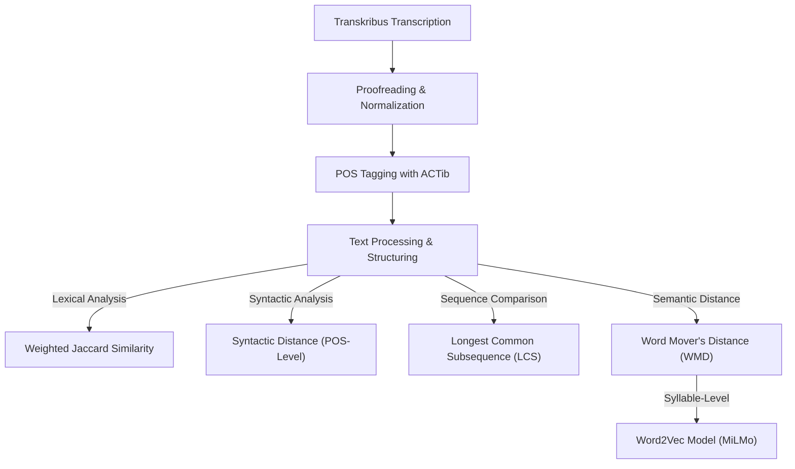

---
{"dg-publish":true,"permalink":"/computational-analysis-of-tibetan-legal-texts/"}
---

# Computational Analysis of Tibetan Legal Texts
## 1. Introduction
This document outlines the use of Python and NLP techniques used to analyze a small  Tibetan text corpus of the *zhal lce bcu drug*. One early edition of the *zhal lce bcu gsum* corpus was also included to explore textual variation. 
Various computational methods, including Word Mover’s Distance (WMD), syntactic distance, Longest Common Subsequence (LCS), and weighted Jaccard similarity, were applied to measure textual similarity and structural differences.

## 2. Text Preparation and Preprocessing

1. **Transcription and Proofreading:** The texts were transcribed using [Transkribus](https://readcoop.eu/transkribus/) and manually proofread to ensure accuracy.
2. **Normalization:** Punctuation was standardized, and abbreviations were expanded for consistency.
3. **POS Tagging with ACTib:** Using [ACTib](https://github.com/lothelanor/actib), Tibetan-specific POS tagging was applied to analyze structural variation. POS (Part-of-Speech) tagging assigns labels to words based on their grammatical function (e.g., noun, verb), helping in structural comparisons across texts. ACTib provides detailed linguistic annotations, including morphological and syntactic features, forming the basis for syntactic distance, LCS, and weighted Jaccard similarity calculations.
4. **Word Embeddings with MiLMo:** The Word2Vec model from [MiLMo](https://huggingface.co/CMLI-NLP/MiLMo) was used for WMD analysis. Word embeddings means the mapping of words or syllables into a numerical space where distances reflect semantic similarity. This technique allows comparison based on meaning rather than just structural alignment, offering insights beyond syntax and vocabulary overlap.
5. **Data Processing:** The POS-tagged output formed the basis for constructing heat maps to compare different texts at lexical, syntactic, and semantic levels.

## 3. Text Corpus
- [[Witnesses/Bailey 16\|Bailey 16]]: as our working hypothesis, we consider this manuscript the oldest in the corpus 
- [[Witnesses/Bhutan 16\|Bhutan 16]], [[Witnesses/Dolanji (16)\|Dolanji (16)]], and [[Witnesses/Leiden (16)\|Leiden (16)]]  all reflect regional variations in textual transmission and are valuable resources for understanding regional adaptations of the legal code.
- <u>Japan13</u>: This manuscript of the *zhal lce bcu gsum* (detailed in the [Toyo Bunko repository](https://toyo-bunko.repo.nii.ac.jp/records/7448)<u></u>), was included to shed light on the textual evolution of the *zhal lce* genre. 

> [!info]
> To maintain alignment, the three missing chapters in <u>Japan13</u> (1, 2, and 16) were added as empty placeholders, causing systematic outliers in the heat maps. 

- **Future Additions:** The [[Witnesses/Bell 16\|Bell 16]] and [[Witnesses/LTWA 02 (16)\|LTWA 02 (16)]] editions are slated for future inclusion in the corpus upon completion of their transcription. 

## 4. Comparison of Similarity Metrics

### 4.1. Word Mover’s Distance (WMD)
- **What it measures:** WMD calculates the effort needed to transform one text into another using word embeddings, capturing semantic similarity. Since the [MiLMo repository](https://huggingface.co/CMLI-NLP/MiLMo)  offers two vector files, one trained on the word-level (藏文-词级别) and another on the syllable-level (藏文-音节). After experimenting with both, I realized that the **Word-level WMD** suffered from segmentation inconsistencies whereas the **Syllable-level WMD** provided more stable results, aligning better with the other similarity metrics. This is likely due to the fact that it **captures sub-word patterns** relevant for morphological variation, and **works better across manuscript traditions** by smoothing out editorial inconsistencies.
- Overall, it **provides a complementary perspective** to the POS-based similarity metrics, capturing semantic relationships beyond structural overlap.

**Interpretation:**
  - The Bhutan, Dolanji, and Leiden versions exhibit relatively small WMD values when compared to each other, suggesting a high degree of semantic similarity.
  - Bailey 16 consistently shows slightly higher WMD values when compared to the Bhutan and Dolanji versions, indicating some lexical or semantic drift in the manuscript tradition.
  - The **highest WMD values appear in chapter 1 across multiple comparisons**, suggesting that it varies significantly in wording across the versions.

### 4.2. Longest Common Subsequence (LCS)
- **What it measures:** LCS identifies the longest shared sequence of POS-tagged words, indicating textual continuity.
  - High LCS values correlated with lower WMD distances.

**Interpretation:**
  - Bhutan vs. Dolanji and Dolanji vs. Leiden show particularly high LCS values, confirming that these versions retain long stretches of identical text.
  - The lowest LCS values (beyond Japan13’s missing sections) are found in certain later chapters when comparing Bailey 16 with the others, possibly indicating editorial changes over time.
  - **Chapters 8 and 10 exhibit very high LCS values**, meaning that these sections are particularly stable across all versions, supporting the idea that they might have been copied with minimal alteration.

### 4.3. Syntactic Distance (POS-Level)
- **What it measures:** This metric calculates how different the grammatical structure of two texts is by comparing their POS sequences.
- Variations in function words and grammatical structures influenced distance calculations.

 **Interpretation:**
  - Certain chapters, such as 8 and 9, show **low syntactic distance**, which means that the sentence structure has been preserved across different versions.
  - Conversely, **chapters 1 and 16 show very high syntactic distances**, suggesting that these sections underwent the most substantial rewording or restructuring.
  - Bailey 16 seems to diverge slightly more in terms of syntactic distance from the Bhutan and Dolanji versions, reinforcing the hypothesis that it represents an older or less standardized variant.

### 4.4. Weighted Jaccard Similarity
- **What it measures:** Weighted Jaccard similarity examines how much vocabulary is shared between two texts, with POS categories influencing the weight.  I therefore created a weight system to account for the importance of specific word categories over others.

**Interpretation:**
  - Weighted Jaccard similarity aligns well with the LCS findings, showing **high lexical overlap in chapters 8-10**.
  - However, chapter 6 has a noticeably lower Jaccard similarity than its corresponding LCS value, suggesting that while the structure is preserved, there are enough small substitutions or variations in vocabulary to decrease overall lexical similarity.
  - The Bhutan and Dolanji versions tend to have the **highest Jaccard similarity scores**, further supporting their close textual relationship.

## 5. Final Data Processing Pipeline

